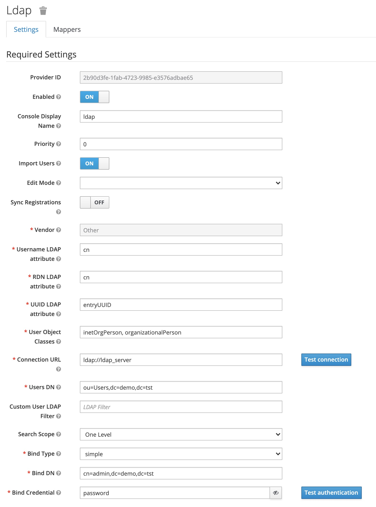

## Objectif

Ce  projet constitue une plateforme de développement, de test ou simplement une démo pour une présentation, dans laquelle les services suivant sont disponible :

* un serveur keycloak
* un serveur de base de donnée postgresql
* un serveur openldap
* un serveur de messagerie
* une application de démonstration
* un reverse proxy dynamique (traefik)

Il y a un certains nombres de pré-requis pour utiliser cette plateforme. Il est nécessaire d'avoir pré-installer :

* le docker engine ainsi que docker-compose
* Make
* un navigateur web

## Utilisation

Il suffit de cloner le repository, de lancer la stack avec la commande suivante et de configurer son fichier hosts.

```
git clone https://github.com/govpf/keycloak-demo
cd keycloak-demo
docker-compose build
docker-compose up -d
```

## Configuration des liens d'accès aux différentes briques applicatives

Dans votre fichier hosts, il faut rajouter les éléments suivants :

```
$ sudo cat /etc/hosts
127.0.0.1   mail.tst demo.tst database.tst
```

## Liste des points d'accès disponible

| Description | Endpoint | Compte d'accès |
| - | - | - |
| Gestionnaire d'identité | http://localhost | admin / password |
| Messagerie | http://mail.tst | N/A |
| Application de démonstration | http://demo.tst | N/A |
| Monitoring proxy | http://localhost:8080 | N/A |
| Visualisation base de donnée | http://database.tst | admin / password |
| Annuaire | ldap://ldap_server | cn=admin,dc=demo,dc=tst / password |

## Comptes utilisateurs de l'annuaire LDAP

| Compte | Mot de passe | Groupes |
| - | - | - |
| admin | password | users / admins |
| user1 | user1 | users / developers |
| user2 | user2 | users / developers |
| user3 | user3 | users |
| user4 | user4 | users |

## Configuration de la fédération d'utilisateur



## Configuration de la messagerie


